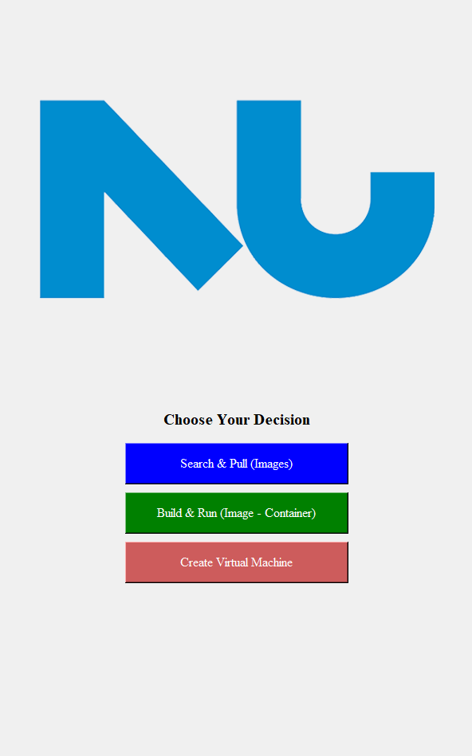

  <h1>Docker and Virtual Machine Management GUI<h1/>
  

## Project Overview
The project aims to create a graphical user interface (GUI) application for managing Docker containers and virtual machines. It provides functionalities for Docker management, Docker image search, and virtual machine management.

## Design
The project is implemented in Python using the tkinter library for the graphical interface. It offers a user-friendly interface for interacting with Docker and VirtualBox. Key features include Dockerfile creation, Docker image building, container management, Docker image search, and virtual machine management.

### Docker Management
The Docker management features allow users to perform various tasks such as creating Dockerfiles, building Docker images, managing containers, and listing images and running containers. The GUI simplifies interaction by providing buttons for each functionality.

### Docker Image Search
The Docker Image Search module enables users to search for Docker images on DockerHub, search for local Docker images, and pull Docker images from DockerHub. Search results are displayed in a new window for user convenience.

### Virtual Machine Management
The virtual machine management section provides options for creating virtual machines interactively or from a configuration file. Users can input parameters like VM name, memory size, and disk size. The configuration file option allows for automation of VM creation.

## Challenges Faced
1. **User Input Validation:** Ensuring user input for Docker image names, tags, and container IDs meets required criteria.
2. **Exception Handling:** Handling exceptions during Docker and VirtualBox operations and providing informative error messages.
3. **GUI Design:** Designing an intuitive and visually appealing interface for easy navigation.

## Solutions Implemented
1. **Input Validation Functions:** Implemented validation functions using regular expressions for Docker image names and tags.
2. **Exception Handling:** Incorporated try-except blocks to handle exceptions during operations and display meaningful error messages.
3. **GUI Design Considerations:** Organized buttons and functionalities logically with proper font, colors, and layout for improved usability.

## Testing Methodologies
1. **Unit Testing:** Conducted unit tests for individual functions to ensure expected outputs.
2. **Integration Testing:** Tested integration of different modules to ensure smooth communication between components.
3. **User Acceptance Testing:** Gathered feedback from potential users to evaluate the usability and intuitiveness of the GUI.
